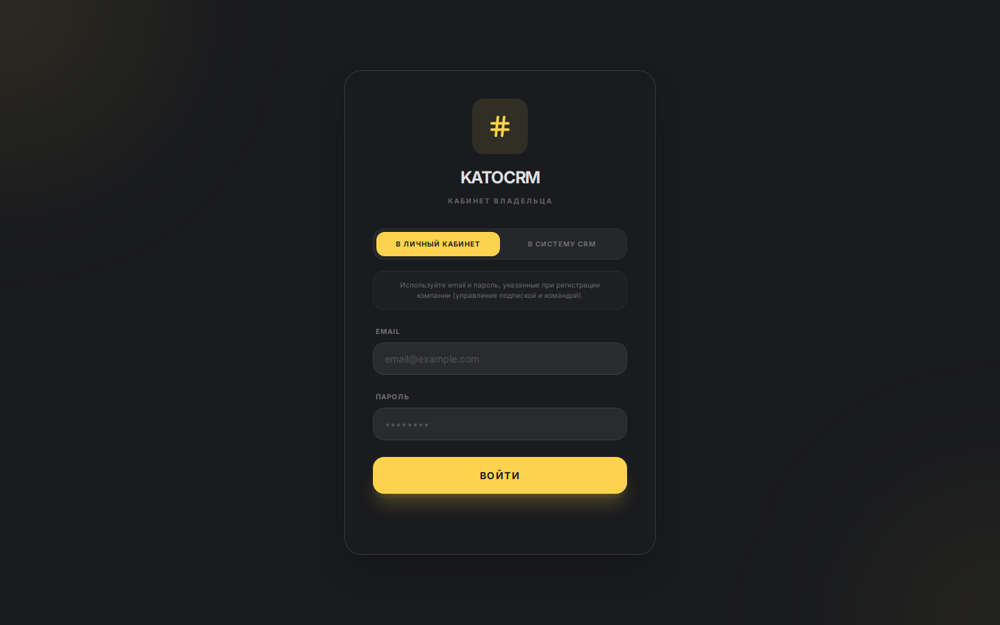

# KATOCRM — мульти-тенантная CRM-платформа

[](#)
[](#)
[](#)

**KATOCRM** — SaaS CRM-платформа для рекрутинга и продаж с AI-ассистентом и мультиканальной коммуникацией. Система обслуживает B2B-клиентов по подписке, интегрирована с Telegram, WhatsApp, email и джоб-бордами (HH.ru, SuperJob).

> Проект создан с нуля за 3 месяца, развёрнут в production на арендованном VPS и используется реальными компаниями. Демо: [katocrm.ru](https://katocrm.ru)

---

## Скриншоты

<p align="center">
  
  
</p>
<p align="center">
  
  
</p>
<p align="center">
  
  
</p>
<p align="center">
  
</p>

---

## Что умеет система

### 🧩 Два режима работы
- **Рекрутинг** — воронка подбора: кандидаты, этапы собеседований, офферы, выход на работу
- **Продажи** — классическая CRM: лиды, сделки, Kanban-доска, закрытие

### 🤖 Агент Като — AI-ассистент
- Работает в фоне: мониторит все сделки, задачи и коммуникации, чтобы ничего не упустить
- Контекстные подсказки по сделкам и кандидатам
- SLA-контроль (просроченные задачи, застоявшиеся сделки)
- Интеграция с DeepSeek API
- Переключение режимов «на лету» без перезагрузки

### 📡 Мультиканальная коммуникация
- **Telegram** — MTProto (GramJS) + Bot API: личные сообщения кандидатам, групповая работа
- **WhatsApp** — Baileys self-hosted шлюз
- **Email** — Nodemailer (SMTP) + IMAP (тикет-система: письма → Telegram-карточки)
- **WebSocket** (Socket.io) — real-time обновления интерфейса

### 💼 Личный кабинет (SaaS)
- Регистрация/логин через email, VK ID, Яндекс ID
- Управление подпиской, командой, платёжными методами
- **ЮKassa** — приём платежей, чеки, автопродление
- 152-ФЗ: согласия ПДн, право на забвение, аудит-лог

### 🔌 Интеграции
- **HH.ru API** — синхронизация вакансий и откликов
- **SuperJob API** — то же самое
- **UniSender** — email-рассылки
- **Lead Capture API** — захват лидов с внешних сайтов

### 🎨 Frontend
- SPA на React 19 + Vite
- Кастомизация рабочего пространства: настраиваемые виджеты, расположение панелей
- Темы: светлая / тёмная + персональный фон рабочего стола
- Адаптивный дизайн (десктоп + Telegram Mini App)
- Анимации на Framer Motion
- Drag-and-drop Kanban-доска

---

## Технический стек

| Слой | Технологии |
|------|-----------|
| **Backend** | NestJS v10, TypeScript, TypeORM, PostgreSQL 16 |
| **Frontend** | React 19, Vite, Zustand, TailwindCSS, Framer Motion |
| **Real-time** | Socket.io (WebSocket rooms per entity) |
| **AI** | DeepSeek API (deepseek-chat), кастомный intent-детектор |
| **Telegram** | GramJS (MTProto) + Telegraf (Bot API) + Telegram Mini App |
| **WhatsApp** | Baileys (self-hosted WebSocket gateway) |
| **Email** | Nodemailer + IMAPFlow (тикет-система) |
| **Платежи** | ЮKassa API (платежи, возвраты, B2B-счета) |
| **Инфраструктура** | Docker Compose, Nginx, Let's Encrypt |
| **Безопасность** | JWT (access + refresh), bcrypt, rate limiting, CORS |

---

## Архитектура

```
katocrm/
├── backend/                  # NestJS (229 .ts файлов, ~30K строк)
│   └── src/
│       ├── modules/          # 25+ feature-модулей
│       │   ├── auth/         # Аутентификация (JWT + VK/Яндекс/LK)
│       │   ├── candidates/   # Кандидаты и воронка
│       │   ├── deals/        # Сделки и pipeline
│       │   ├── telegram/     # MTProto-клиент + боты
│       │   ├── email/        # IMAP/SMTP пайплайн
│       │   ├── ai/           # Агент Като (AI-ассистент)
│       │   └── ...           # tasks, chats, knowledge-base, etc.
│       ├── entities/         # 40+ TypeORM-сущностей
│       └── common/           # Guards, filters, interceptors
├── frontend/                 # React 19 (174 файла, ~49K строк)
│   └── src/
│       ├── pages/            # Роуты: /pipeline, /candidates, /tasks
│       ├── components/       # UI-кит + CRM-компоненты
│       ├── store/            # Zustand-сторы (per entity)
│       └── hooks/            # Shared hooks
├── landing/                  # Лендинг + privacy-policy
├── bots/                     # support-bot.js, crm-bot.js
├── nginx/                    # Nginx конфигурация
├── docker-compose.prod.yml   # Продакшн-стек: 7 контейнеров
└── Dockerfile                # Multi-stage build
```

**Ключевые архитектурные решения:**
- **Multi-tenant** — изоляция данных через tenantId на всех сущностях
- **Feature-based** — каждый модуль автономен (entity + dto + service + controller)
- **JSONB для гибкости** — кастомные поля без миграций
- **Soft delete** — все критические сущности не удаляются физически
- **Fire-and-forget для внешних сервисов** — Telegram-нотификации не блокируют API-ответы

---

## Статус проекта

- ✅ **Production** — deployed на VPS, активные пользователи
- ✅ Регистрация через лендинг → 7-дневный trial
- ✅ Приём платежей через ЮKassa
- ✅ Telegram Mini App
- ✅ WhatsApp-интеграция
- ✅ Импорт вакансий с HH.ru / SuperJob
- 🔄 Мобильное приложение (iOS — GitHub Actions build)

---

## В цифрах

| Метрика | Значение |
|---------|---------|
| **Backend** | 229 .ts файлов, ~30K строк кода |
| **Frontend** | 174 .tsx файла, ~49K строк кода |
| **Feature-модули** | 25+ |
| **TypeORM-сущности** | 40+ |
| **Production-контейнеры** | 7 (Nginx, App, DB, WhatsApp, 2 бота, Certbot) |
| **Время разработки** | 3 месяца → production |
| **Интегрированные каналы** | Telegram, WhatsApp, Email, HH.ru, SuperJob |
| **Платежи** | ЮKassa (подписки, B2B-счета) |
| **Аутентификация** | Email, VK ID, Яндекс ID |
